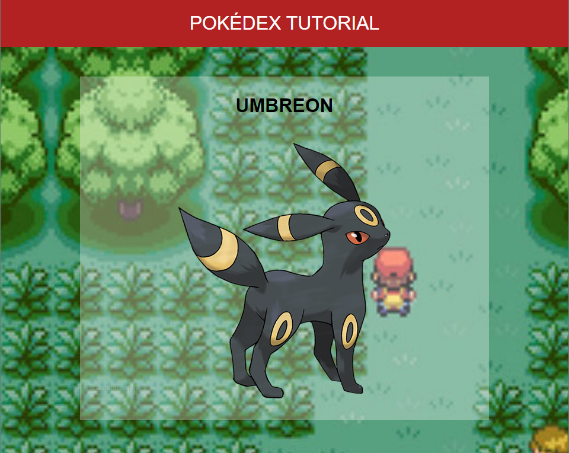

# Pokédex Tutorial



This repo contains the starter code to create a simple Pokédex web application.

Follow along [here](https://lemonpole.gitbook.io/pokedex-tutorial/).

## Notes

### Creating GIFs

As an alternative to using online GIF creation services, creating high quality GIFs (with a small file size) can be done from your computer using [ffmpeg](https://ffmpeg.org/download.html).

```bash
ffmpeg -y -i input.mp4 -vf "fps=10,split[s0][s1];[s0]palettegen[p];[s1][p]paletteuse" output.gif
```

The key is to use a mixture of `palettegen` and `paletteuse` as expertly explained in this [Stack Overflow answer](https://superuser.com/a/556031).

You can also crop videos, which is useful if you're looking to make a GIF from a larger screen recording. The filter arguments are:

- `485` width
- `400` height
- `2px` x-offset
- `1px` y-offset

```bash
ffmpeg -y -i input.mp4 -vf "crop=485:400:2:1,fps=10,split[s0][s1];[s0]palettegen[p];[s1][p]paletteuse" output.gif
```
